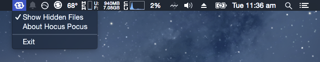

Hocus Pocus is a very simple, menu bar only, pure Swift app which lets you show hidden files on OS X and also hide them again. This app requires Yosemite (OS X 10.10) or higher to run. 

## Download 
Download the latest [version v0.1](https://github.com/avinassh/Hocus-Pocus/releases/download/v0.1/Hocus-Pocus.zip). 

## Screenshot

## Features
It has no Menu bar or Dock icon, only runs in Status Bar. Just click on `Show Hidden Files` to show(or hide) hidden and system files. 

## Building Hocus Pocus
Requirements:

- Xcode 6.1
- Swift 1.1 (not 1.2)

## To do
- Add ability to hide/show any files, folder
- Kill and restart Dock, Finder or MenuBar
- Preferences: Start at login
- Hide all files on Desktop
- Add shortcut keybindings
- Port to Swift 1.2

## License
The MIT License (MIT). Check `LICENSE`

## Credits

- StatusBar Icon by [MaxXx](https://www.iconfinder.com/icons/342701/media_refresh_reload_retweet_social_sync_update_icon), released under [CC BY 2.5](http://creativecommons.org/licenses/by/2.5/).
- AppIcon by [YOOtheme](https://www.iconfinder.com/icons/60816/ghost_icon), released under Free for commercial use license.